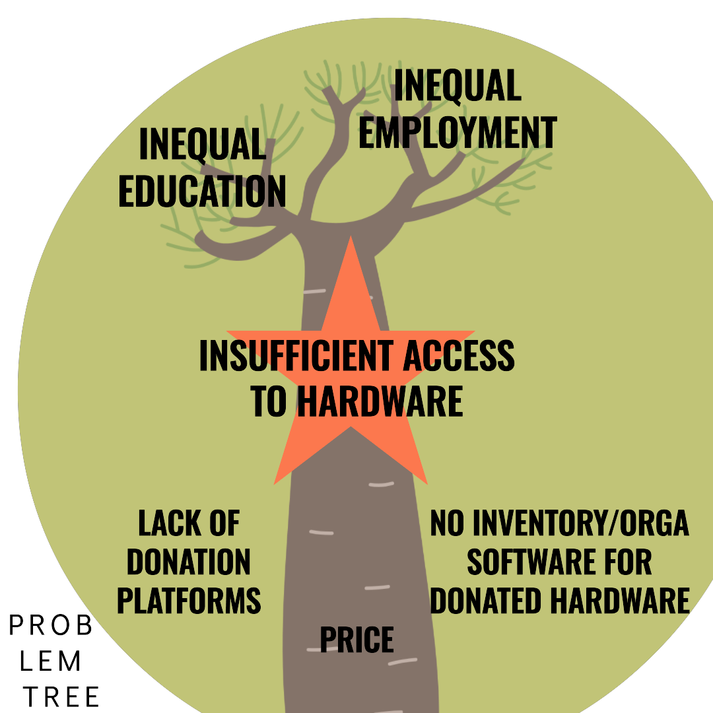
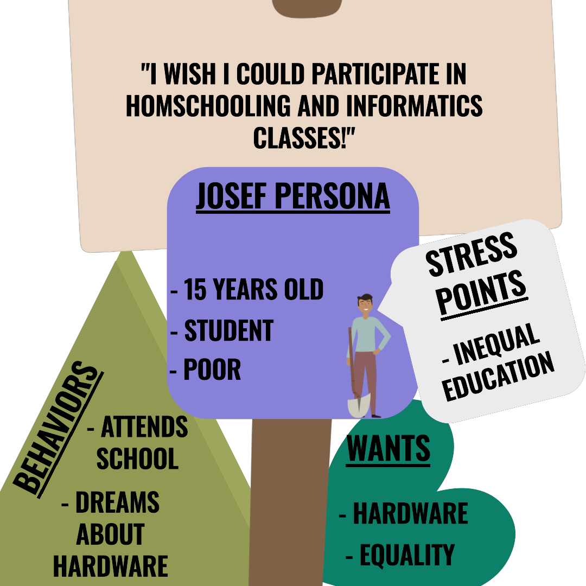

# Hackathon 23
## 1: Portfolio
### 1.1: Products
#### 1.1.1: DIY Problem Definition
**What is the key issue you are tying to address and why is it important?**\
Due to socio-economic inequalities, acquiring the hardware nescessary for education in the modern and increasingly digitalized world is not viable for every student.
As a consequence, there is a limited chance of obtaining an optimal education.
Solving this problem is important beacause it is nescessary to enable equal access to education for every studnet to move towards a more equal world.\
\
**Who is it a problem for?**\
Students from disadvantaged socio-economic backgrounds.\
\
**What social/cultural factors shape this problem?**\
This problem is shaped by the income and assets of the family.
Families of a less fortunate background have less access to hardware.\
\
**What evidence do you have that this is worth the investment?**\
There are many ways that a lack of hardware presents itself in the modern world.
One big result of the lack of access to quality and digital education is the lack of qualified experts in the field of IT.
Furthermore, lacking hardware hinders the development of homeschooling opportunities.\
\
**Can you think of this problem in a different way? Can you reframe it?**\
In order to ensure an equal and inclusive society, the opportinuties must be equal for all students, regardless of background. 
Without a means of accessing or centralizing the freely available resources, those of disadvantaged socio-economic backgrounds will have inequal access to modern, quality education.
#### 1.1.2: Problem Tree

#### 1.1.3: Student Persona

### 1.2: Peer Feedback
The following feedback was provided by our peer group:
- Good design.
- More personas could be considered.
- Lack of technical know-how should be considered as an aspect/cause.
## 2: Prototype
## 3: Credits
Jan Leon Greve\
Kamyab Bagherifar\
Maximilian Staas\
Redon Kurta