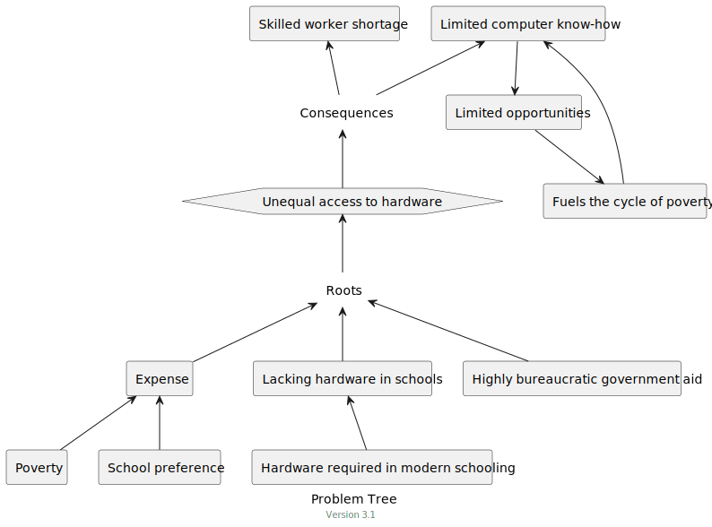
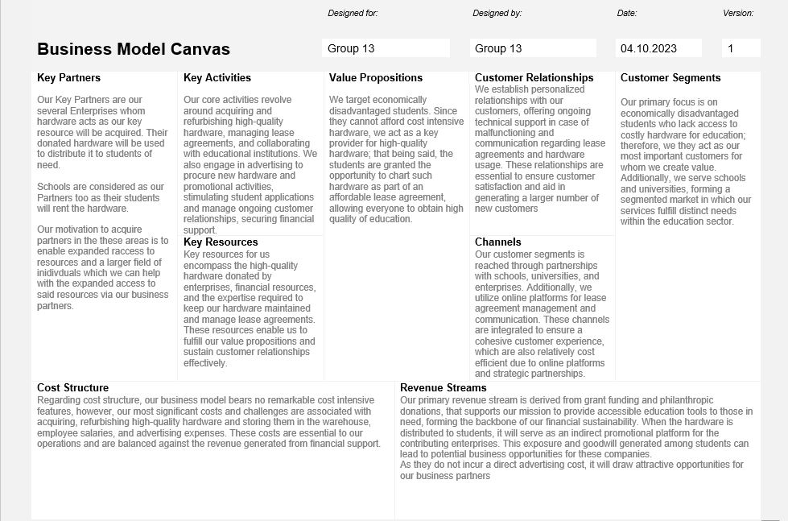
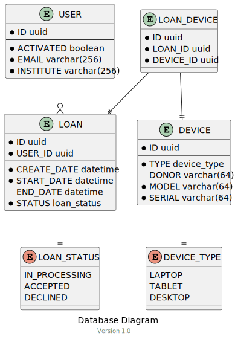

# Hackathon 23

<!-- TOC -->
* [Hackathon 23](#hackathon-23)
  * [0: About](#0-about)
    * [0.1: Current Stage](#01-current-stage)
    * [0.2: Stages](#02-stages)
  * [1: Portfolio](#1-portfolio)
    * [1.1: Products](#11-products)
      * [1.1.1: DIY Problem Definition 3.0](#111-diy-problem-definition-30)
      * [1.1.2: Problem Tree](#112-problem-tree)
      * [1.1.3: Student Persona](#113-student-persona)
      * [1.1.4: Parent Persona](#114-parent-persona)
      * [1.1.5: Teacher Persona](#115-teacher-persona)
      * [1.1.6 Ideation Mindmap](#116-ideation-mindmap)
      * [1.1.7 School Usecase](#117-school-usecase)
      * [1.1.8 Business Usecase](#118-business-usecase)
      * [1.1.9 Business Canvas](#119-business-canvas)
    * [1.2: Peer Feedback](#12-peer-feedback)
  * [2: Prototype](#2-prototype)
    * [2.1: Products](#21-products)
      * [2.1.1: Technical Mindmap](#211-technical-mindmap)
      * [2.1.2: Loan Endpoint](#212-loan-endpoint)
      * [2.1.3: User Endpoint](#213-user-endpoint)
      * [2.1.4: Database Diagram](#214-database-diagram)
  * [3: "Go Viral" Post](#3-go-viral-post)
  * [4: Personal Goals](#4-personal-goals)
  * [5: Credits](#5-credits)
<!-- TOC -->

## 0: About
### 0.1: Current Stage
**Prototype Phase: Sprint 3**

We are currently in the stage of implementing and refining our solution.

### 0.2: Stages
1. [x] Problem Phase: First Iteration
2. [x] Problem Phase: Peer Feedback
3. [x] Problem Phase: Second Iteration
4. [x] Problem Phase: Teacher Feedback
5. [x] Problem Phase: Third Iteration
6. [x] Prototype Phase: Brainstorming
7. [x] Prototype Phase: Planning
8. [x] Prototype Phase: Sprint 1
9. [x] Prototype Phase: Sprint 2
10. [x] Prototype Phase: Sprint 3
11. [ ] Presentation Phase

## 1: Portfolio

### 1.1: Products

#### 1.1.1: DIY Problem Definition 3.0

**What is the key issue you are trying to address and why is it important?**\
The key issue we are trying to address unequal access to hardware.\
We see this issue as the main roadblock keeping students at every level
of education from benefiting fully from modern technologies in education,
such as digital and interactive media, game-based and gamified education, 
digital learning platforms, and interactive video communication applications.\
Such technologies have the potential to make education more efficient, effective, and individual by
providing students with a more interactive, engaging, and personal learning experience while also
accelerating group collaboration and growing the critical social and technical skills needed in many modern occupations.
These methods can help teachers and administrators teach, organize, and interact with their students faster and more effectively. 
Moreover, they may enable parents to better track their children's progress and get feedback from their teachers.

\
**Who is it a problem for?**\
This issue impacts:

- Students from socio-economically disadvantaged backgrounds
- Teachers
- Parents

\
**What social/cultural factors shape this problem?**\
This problem is shaped by:

_Socio-economic background._
A disadvantaged socio-economic background may prevent students and parents from financing necessary or desired hardware.

_Socio-cultural background._
Lacking access to hardware can hinder students in socialization in the personal and educational context
and may even lead to social ostracization of students by their peers.

\
**What evidence do you have that this is worth the investment?**\
One of the most evident consequences of lacking IT know-how is the
well-known skilled worker shortage in Germany. As reported by the [tagesschau](https://www.tagesschau.de/wirtschaft/it-berufe-fachkraftemangel-rekord-100.html),
almost 68000 IT jobs remain unfilled. If students had earlier and more substantial
access to hardware, such shortages may not have occurred.

\
**Can you think of this problem in a different way? Can you re-frame it?**

Children from disadvantaged backgrounds have limited opportunities to socialize,
especially in the digital realm, where gaming in Fortnite becomes an important cornerstone
in every youth's afternoon. By providing the youth with the hardware they
lack, they will be able to socialize in modern mediums such as Gaming, reducing their
social exclusion due to their socio-economic status.

#### 1.1.2: Problem Tree

#### 1.1.3: Student Persona

#### 1.1.4: Parent Persona

#### 1.1.5: Teacher Persona

#### 1.1.6 Ideation Mindmap

#### 1.1.7 School Usecase

#### 1.1.8 Business Usecase

#### 1.1.9 Business Canvas

### 1.2: Peer Feedback

Our peer group provided the following feedback:

- Good design.
- More personas could be considered.
- Lack of technical know-how should be considered as an aspect/cause.

We immediately noticed your very attractive portfolio. We found it to be clearly designed and modern. We think your theme is contemporary and important. We would like to see one more exemplary person. We had the impression that you had a special target group in mind. You have worked out the problem of low hardware for students with low income very well. 
We feel that the problem has not yet been fully thought through. In our opinion, another persona/target group would give you a new perspective on the problem as an example. We liked how we could discuss this in our common conversation. 
In general, we think you guys have come up with a solid problem. Now we hope that you think about the necessary steps, such as: resetting the laptops and PCs, that the organization is regulated by the schools and whether the procurement of the devices is sufficient if the students can not operate them because there are no teachers who are trained.

## 2: Prototype

### 2.1: Products

#### 2.1.1: Technical Mindmap

#### 2.1.2: Loan Endpoint

#### 2.1.3: User Endpoint

#### 2.1.4: Database Diagram

## 3: "Go Viral" Post

🚀 🌟 **Exciting Opportunity to Make a Difference!** 🌟 🚀

Hey there, amazing changemakers! 🌍✨

We all know the world is rapidly advancing, and technology is at the heart of this progress. But here's the harsh reality: not every child has access to the tools they need to thrive in this digital age. That's where YOU come in!

🎉 **Introducing our 'HeartWare' Campaign!** 🎉

We are on a mission to bridge the digital divide, ensuring every child has the opportunity to learn and grow, both in school and at home. How? By teaming up with compassionate companies like yours! 🤝

🔹 **What Can You Do?** 🔹

Do you have old tablets and PCs gathering dust in your office? Don't let them languish when they could be changing lives! Send them to us, and we'll put them directly into the hands of children who need them the most. 🌟

💼 **Benefits for Your Company:** 💼

1️⃣ **Social Impact:** Be a part of a movement that's transforming lives and shaping futures.
2️⃣ **Environmental Responsibility:** Reduce electronic waste and contribute to a greener planet.
3️⃣ **Positive Publicity:** Gain recognition for your company's philanthropic efforts, showcasing your commitment to social responsibility.

🌈 **Together, We Can Empower Dreams!** 🌈

Imagine the joy on a child's face when they receive their very own device, opening doors to a world of knowledge. With your support, we can make this dream a reality for countless children.

🚀 **How to Get Involved:** 🚀

1️⃣ **Gather Your Hardware:** Collect all those unused tablets and PCs.
2️⃣ **Reach Out:** Contact us via our website to arrange a donation.
3️⃣ **Spread the Word:** Share this post far and wide! Let your networks know about this fantastic opportunity to give back.

Let's break barriers, one device at a time. 💪 Together, we can empower the next generation, providing them with the tools they need to succeed. Join us in shaping a brighter future! 🌟✨

#TechForTomorrow #DigitalInclusion #EducationForAll #EmpowerTheFuture #MakeADifference 🌍✊

## 4: Personal Goals

_Jan Leon Greve:_

Goal:

My personal goal is to increase my experience with UML and project planning,
as well as Kotlin backend programming.

Reflection:

On reflection, I managed to greatly increase my experience with and knowledge of Kotlin,
especially regarding web app programming. 
I also gained a great deal of experience with designing UML
using PlantUML and had and opportunity to refine my knowledge of project planning.

_Kamyab Bagherifar:_

  Goal:
  My personal goal is to get experience with Kotlin programming and improve my knowledge in kotlin 

  Reflection:
  I'm able to create simple REST-API with JWT Authentication using Ktor and Exposed Framework.

_Maximilian Staas:_

  Goal:
  My personal goal is to get a first look into Kotlin and to improve my understanding on how to build a user-friendly, easy to navigate web page.

  Reflection:
  I know am able to read and understand basic Kotlin code and got a better understanding of the elements of a modern webpage.

_Redon Kurta:_

  Goal:
  My personal goal describes my desire to expand my Kotlin Programming skills and get more in depth into project management. 

  Reflection:
  All in all, through dedication and discipline, I succeeded in obtaining knowledge regarding Kotlin programming and integrating a database connection to a Kotlin project. Utilizing pair programming, I encountered the highest learning rate as we could share our knowledge and, thus, learn a lot from each other.

## 5: Credits

Jan Leon Greve\
Kamyab Bagherifar\
Maximilian Staas\
Redon Kurta
